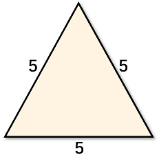

# Ichihime and Triangle

> https://codeforces.com/problemset/problem/1337/A

```
time limit per test	:	1 second
memory limit per test	:	256 megabytes
input			:	standard input
output			:	standard ouput
```

## Problem

Ichihime is the current priestess of the Mahjong Soul Temple. She claims to be human, despite her cat ears.

These days the temple is holding a math contest. Usually, Ichihime lacks interest in these things, but this time the prize for the winner is her favorite — cookies. Ichihime decides to attend the contest. Now she is solving the following problem.


 
You are given four positive integers ***a***, ***b***, ***c***, ***d***, such that ***a*** ≤ ***b*** ≤ ***c*** ≤ ***d***.

Your task is to find three integers ***x***, ***y***, ***z***, satisfying the following conditions:

* ***a*** ≤ ***x*** ≤ ***b***.
* ***b*** ≤ ***y*** ≤ ***c***.
* ***c*** ≤ ***z*** ≤ ***d***.
* There exists a triangle with a positive non-zero area and the lengths of its three sides are ***x***, ***y***, and ***z***.

Ichihime desires to get the cookie, but the problem seems too hard for her. Can you help her?

## Input

The first line contains a single integer ***t*** (***1*** ≤ ***t*** ≤ ***1000***)  — the number of test cases.

The next ***t*** lines describe test cases. Each test case is given as four space-separated integers ***a***, ***b***, ***c***, ***d*** ( ***1*** ≤ ***a*** ≤ ***b*** ≤ ***c*** ≤ ***d*** ≤ ***10<sup>9</sup>*** ).

## Output

For each test case, print three integers ***x***, ***y***, ***z***  — the integers you found satisfying the conditions given in the statement.

It is guaranteed that the answer always exists. If there are multiple answers, print any.

## Examples

---
**input**
```
4
1 3 5 7
1 5 5 7
100000 200000 300000 400000
1 1 977539810 977539810
```
**output**
```
3 4 5
5 5 5
182690 214748 300999
1 977539810 977539810
```
---

## Note

One of the possible solutions to the first test case:


One of the possible solutions to the second test case:



## Solution

```c++
//Lang		:	GNU C++14
//Time		:	15 ms
//Memory	:	0 KB
#include<iostream>
using namespace std;
bool estriangulo(int x,int y,int z){
	if(x<y+z && y<x+z && z<x+y){return true;}
	return false;
}
void triangulo(int a,int b,int c,int d){
	if(estriangulo(a,b,c)){cout<<a<<" "<<b<<" "<<c<<endl;}
	else if(estriangulo(b,c,d)){cout<<b<<" "<<c<<" "<<d<<endl;}
	else if(estriangulo(b,b,c)){cout<<b<<" "<<b<<" "<<c<<endl;}
	else if(estriangulo(b,c,c)){cout<<b<<" "<<c<<" "<<c<<endl;}
}
int main(){
	int t,a,b,c,d;
	while(cin>>t){
		while(t--){
			cin>>a>>b>>c>>d;
			triangulo(a,b,c,d);
		}
	}
	return 0;
}
```
