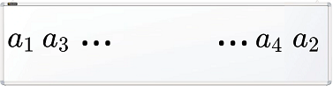

# Favorite Sequence

> https://codeforces.com/problemset/problem/1462/A

```
time limit per test	:	2 seconds
memory limit per test	:	256 megabytes
input			:	standard input
output			:	standard ouput
```

## Problem

Polycarp has a favorite sequence ***a***[***1***…***n***] consisting of ***n*** integers. He wrote it out on the whiteboard as follows:

* he wrote the number ***a<sub>1</sub>*** to the left side (at the beginning of the whiteboard);
* he wrote the number ***a<sub>2</sub>*** to the right side (at the end of the whiteboard);
* then as far to the left as possible (but to the right from ***a<sub>1</sub>*** ), he wrote the number ***a<sub>3</sub>*** ;
* then as far to the right as possible (but to the left from ***a<sub>2</sub>*** ), he wrote the number ***a<sub>4</sub>*** ;
* Polycarp continued to act as well, until he wrote out the entire sequence on the whiteboard.

||
|:--:|
|The beginning of the result looks like this (of course, if ***n*** ≥ ***4***).|

For example, if ***n***=***7*** and ***a***=[***3***,***1***,***4***,***1***,***5***,***9***,***2***], then Polycarp will write a sequence on the whiteboard [***3***,***4***,***5***,***2***,***9***,***1***,***1***].

You saw the sequence written on the whiteboard and now you want to restore Polycarp's favorite sequence.

## Input

The first line contains a single positive integer ***t*** (***1*** ≤ ***t*** ≤ ***300***) — the number of test cases in the test. Then ***t*** test cases follow.

The first line of each test case contains an integer ***n*** (***1*** ≤ ***n*** ≤ ***300***) — the length of the sequence written on the whiteboard.

The next line contains ***n*** integers ***b<sub>1</sub>*** , ***b<sub>2</sub>*** ,…, ***b<sub>n</sub>*** ( ***1*** ≤ ***b<sub>i</sub>*** ≤ ***10<sup>9</sup>*** ) — the sequence written on the whiteboard.

## Output

Output ***t*** answers to the test cases. Each answer — is a sequence a that Polycarp wrote out on the whiteboard.

## Examples

---
**input**
```
6
7
3 4 5 2 9 1 1
4
9 2 7 1
11
8 4 3 1 2 7 8 7 9 4 2
1
42
2
11 7
8
1 1 1 1 1 1 1 1
```
**output**
```
3 1 4 1 5 9 2 
9 1 2 7 
8 2 4 4 3 9 1 7 2 8 7 
42 
11 7 
1 1 1 1 1 1 1 1 
```
---

## Note

In the first test case, the sequence a matches the sequence from the statement. The whiteboard states after each step look like this:

[***3***]⇒[***3***,***1***]⇒[***3***,***4***,***1***]⇒[***3***,***4***,***1***,***1***]⇒[***3***,***4***,***5***,***1***,***1***]⇒[***3***,***4***,***5***,***9***,***1***,***1***]⇒[***3***,***4***,***5***,***2***,***9***,***1***,***1***].

## Solution

```c++
//Lang		:	GNU C++14
//Time		:	78 ms
//Memory	:	0 KB
#include<iostream>
#include<deque>
using namespace std;
int main(){
	int t,a,n;
	while(cin>>t){
		while(t--){
			cin>>n;
			deque<int> b,v;
			while(n--){
				cin>>a;
				b.push_back(a);
			}
			int t=0;
			while(b.size()!=0){
				if(t%2==0){v.push_back(b[0]);b.pop_front();}
				else{v.push_back(b[b.size()-1]);b.pop_back();}
				t++;
			}
			for(int i=0;i<v.size();i++){
				cout<<v[i]<<" ";
			}cout<<endl;
		}
	}
	return 0;
}
```
