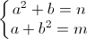

# System of Equations
> https://codeforces.com/problemset/problem/214/A
```
time limit per test	:	2 seconds
memory limit per test	:	256 megabytes
input			:	standard input
output			:	standard output
```
## Problem
Furik loves math lessons very much, so he doesn't attend them, unlike Rubik. But now Furik wants to get a good mark for math. For that Ms. Ivanova, his math teacher, gave him a new task. Furik solved the task immediately. Can you?

You are given a system of equations:  
  


You should count, how many there are pairs of integers (a, b) (0 ≤ a, b) which satisfy the system.

## Input
A single line contains two integers n, m (1 ≤ n, m ≤ 1000) — the parameters of the system. The numbers on the line are separated by a space.

## Output
On a single line print the answer to the problem.
## Examples
---
**input**
```
9 3
```
**output**
```
1
```
---
**input**
```
14 28
```
**output**
```
1
```
---
**input**
```
4 20
```
**output**
```
0
```
---
## Note
Note
In the first sample the suitable pair is integers (3, 0). In the second sample the suitable pair is integers (3, 5). In the third sample there is no suitable pair.
## Solution 1
```c++
#include <iostream>
#include <math.h>
int n,m,a,b,casos;
using namespace std;

int main() {
	cin>>n>>m;
	for(int i=0;i<=m;i++){
	    if(sqrt(m-i)+pow(i,2)==n){
	        a++;
	    }
	}
	for(int i=0;i<=n;i++){
	    if(sqrt(n-i)+pow(i,2) == m){
	        b++;
	    }
	}
	//casos=a*b;
	if(a>0 && b>0){
	    casos=a;
	}
	cout<<casos<<endl;
	return 0;
}
```
## Solution 2
```c++
//Lang		:	GNU C++11
//Time		:	62 ms
//Memory	:	3800 KB
#include<iostream>
#include<vector>
#include<utility>
#include<algorithm>
using namespace std;
int main(){
	int n,m;
	while(cin>>n>>m){
		vector< pair<int,int> > v1,v2;
		for(int i=0;i<=n;i++){
			for(int j=0;j<=n;j++){
				if((i*i)+j==n){
					v1.push_back(make_pair(i,j));
				}
				if(i+(j*j)==m){
					v2.push_back(make_pair(i,j));
				}
			}
		}
		sort(v1.begin(),v1.end());
		sort(v2.begin(),v2.end());
		vector<pair<int, int>> v;
		set_intersection(v1.begin(), v1.end(), v2.begin(), v2.end(),back_inserter(v));
		cout<<v.size()<<"\n";
	}
}
```
