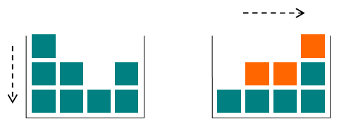

# Gravity Flip

> https://codeforces.com/problemset/problem/405/A

```
time limit per test	:	1 seconds
memory limit per test	:	256 megabytes
input			:	standard input
output			:	standard ouput
```

## Problem

Little Chris is bored during his physics lessons (too easy), so he has built a toy box to keep himself occupied. The box is special, since it has the ability to change gravity.

There are n columns of toy cubes in the box arranged in a line. The *i*-th column contains a<sub>i</sub> cubes. At first, the gravity in the box is pulling the cubes downwards. When Chris switches the gravity, it begins to pull all the cubes to the right side of the box. The figure shows the initial and final configurations of the cubes in the box: the cubes that have changed their position are highlighted with orange.



Given the initial configuration of the toy cubes in the box, find the amounts of cubes in each of the n columns after the gravity switch!

## Input

The first line of input contains an integer n (1 ≤ n ≤ 100), the number of the columns in the box. The next line contains n space-separated integer numbers. The *i*-th number a<sub>i</sub> (1 ≤ a<sub>i</sub> ≤ 100) denotes the number of cubes in the *i*-th column.

## Output

Output n integer numbers separated by spaces, where the *i*-th number is the amount of cubes in the *i*-th column after the gravity switch.

## Examples

---
**input**
```
4
3 2 1 2
```
**output**
```
1 2 2 3 
```
---
**input**
```
3
2 3 8
```
**output**
```
2 3 8 
```
---

## Note

The first example case is shown on the figure. The top cube of the first column falls to the top of the last column; the top cube of the second column falls to the top of the third column; the middle cube of the first column falls to the top of the second column.

In the second example case the gravity switch does not change the heights of the columns.

## Solution 1: a lo bruto

```c++
//Lang		:	GNU C++14
//Time		:	15 ms
//Memory	:	300 KB
#include<iostream>
#include<vector>
#include<algorithm>
using namespace std;
vector<vector<int> > transpose(const vector<vector<int> > &b){
    vector<vector<int> > trans_vec(b[0].size(), vector<int>());
    for (int i = 0; i < b.size(); i++){
        for (int j = 0; j < b[i].size(); j++){
            trans_vec[j].push_back(b[i][j]);
        }
    }
    return trans_vec;
}
int main(){
	int n,a;
	while(cin>>n){
		vector<int> w;
		int mayor=0;
		while(n--){
			cin>>a;
			w.push_back(a);
			mayor=max(mayor,a);
		}
		vector<vector<int> > v(w.size(),vector<int>(mayor,0));
		for(int i=0;i<v.size();i++){	
			int j=0;
			while(j<w[i]){
				v[i][j]=1;
				j++;
			}
		}
		v=transpose(v);
		for(int i=0;i<v.size();i++){	
			for(int j=v[i].size()-1;j>=0;j--){	
				bool termina=false;
				if(v[i][j]==0){
					int t=j;
					while(t-- && termina==false){
						if(v[i][t]==1){
							swap(v[i][j],v[i][t]);
							termina=true;
						}
					}
				}
			}
		}
		v=transpose(v);
		for(int i=0;i<v.size();i++){	
			cout<<count(v[i].begin(),v[i].end(),1)<<" ";
		}cout<<endl;
	}
	return 0;
}
```

## Solution 2: pensando

```c++
//Lang		:	GNU C++14
//Time		:	15 ms
//Memory	:	0 KB
#include<iostream>
#include<vector>
#include<algorithm>
using namespace std;
int main(){
	int n,a;
	while(cin>>n){
		vector<int> v;
		while(n--){
			cin>>a;
			v.push_back(a);
		}
		sort(v.begin(),v.end());
		for(int i=0;i<v.size();i++){
			cout<<v[i]<<" ";
		}cout<<endl;
	}
	return 0;
}
```
