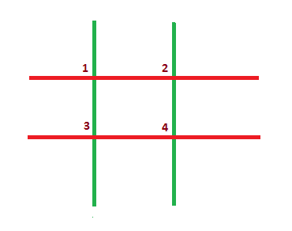

# Game With Sticks

> https://codeforces.com/problemset/problem/451/A 

```
time limit per test	:	1 seconds
memory limit per test	:	256 megabytes
input			:	standard input
output			:	standard ouput
```

## Problem

After winning gold and silver in IOI 2014, Akshat and Malvika want to have some fun. Now they are playing a game on a grid made of n horizontal and m vertical sticks.

An intersection point is any point on the grid which is formed by the intersection of one horizontal stick and one vertical stick.

In the grid shown below, n = 3 and m = 3. There are n + m = 6 sticks in total (horizontal sticks are shown in red and vertical sticks are shown in green). There are n·m = 9 intersection points, numbered from 1 to 9.


The rules of the game are very simple. The players move in turns. Akshat won gold, so he makes the first move. During his/her move, a player must choose any remaining intersection point and remove from the grid all sticks which pass through this point. A player will lose the game if he/she cannot make a move (i.e. there are no intersection points remaining on the grid at his/her move).

Assume that both players play optimally. Who will win the game?

## Input

The first line of input contains two space-separated integers, n and m (1 ≤ n, m ≤ 100).

## Output

Print a single line containing "Akshat" or "Malvika" (without the quotes), depending on the winner of the game.

## Examples

---
**input**
```
2 2
```
**output**
```
Malvika
```
---
**input**
```
2 3
```
**output**
```
Malvika
```
---
**input**
```
3 3
```
**output**
```
Akshat
```
---

## Note

Explanation of the first sample:

The grid has four intersection points, numbered from 1 to 4.



If Akshat chooses intersection point 1, then he will remove two sticks (1 - 2 and 1 - 3). The resulting grid will look like this.


Now there is only one remaining intersection point (i.e. 4). Malvika must choose it and remove both remaining sticks. After her move the grid will be empty.

In the empty grid, Akshat cannot make any move, hence he will lose.

Since all 4 intersection points of the grid are equivalent, Akshat will lose no matter which one he picks.

## Solution

```c++
//Lang		:	GNU C++14
//Time		:	15 ms
//Memory	:	0 KB
#include<iostream>
using namespace std;
void swap(int& x,int& y){
	x^=y;y^=x;x^=y;
}
int main(){
	int n,m;
	while(cin>>n>>m){
		if(n>m){swap(n,m);}
		if(n%2==0){cout<<"Malvika\n";}
		else{cout<<"Akshat\n";}
	}
	return 0;
}
```
