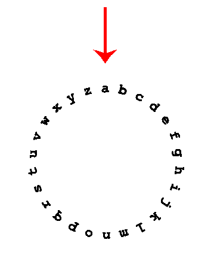
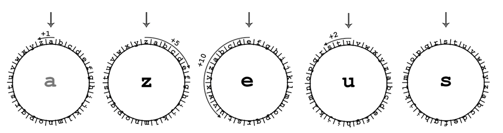

# Night at the Museum

> https://codeforces.com/problemset/problem/731/A

```
time limit per test	:	1 second
memory limit per test	:	256 megabytes
input			:	standard input
output			:	standard ouput
```

## Problem

Grigoriy, like the hero of one famous comedy film, found a job as a night security guard at the museum. At first night he received embosser and was to take stock of the whole exposition.

Embosser is a special devise that allows to "print" the text of a plastic tape. Text is printed sequentially, character by character. The device consists of a wheel with a lowercase English letters written in a circle, static pointer to the current letter and a button that print the chosen letter. At one move it's allowed to rotate the alphabetic wheel one step clockwise or counterclockwise. Initially, static pointer points to letter '***a***'. Other letters are located as shown on the picture:



After Grigoriy add new item to the base he has to print its name on the plastic tape and attach it to the corresponding exhibit. It's not required to return the wheel to its initial position with pointer on the letter '***a***'.

Our hero is afraid that some exhibits may become alive and start to attack him, so he wants to print the names as fast as possible. Help him, for the given string find the minimum number of rotations of the wheel required to print it.

## Input

The only line of input contains the name of some exhibit — the non-empty string consisting of no more than 100 characters. It's guaranteed that the string consists of only lowercase English letters.

## Output

Print one integer — the minimum number of rotations of the wheel, required to print the name given in the input.

## Examples

---
**input**
```
zeus

```
**output**
```
18

```
---
**input**
```
map

```
**output**
```
35

```
---
**input**
```
ares

```
**output**
```
34

```
---

## Note



To print the string from the first sample it would be optimal to perform the following sequence of rotations:

1. from 'a' to 'z' (1 rotation counterclockwise),
2. from 'z' to 'e' (5 clockwise rotations),
3. from 'e' to 'u' (10 rotations counterclockwise),
4. from 'u' to 's' (2 counterclockwise rotations).

In total, 1 + 5 + 10 + 2 = 18 rotations are required.

## Solution

```c++
//Lang		:	GNU C++14
//Time		:	15 ms
//Memory	:	0 KB
#include<iostream>
#include<math.h>
using namespace std;
int main(){
	string s;
	while(cin>>s){
		s='a'+s;
		int r=0;
		for(int i=0;i<s.size()-1;i++){
			int d1=abs(int(s[i]-97)-int(s[i+1]-123));
			int d2=abs(int(s[i]-97)-int(s[i+1]-97));
			int d3=abs(int(s[i]-97)-int(s[i+1]-71));
			r+=min(min(d1,d2),min(d2,d3));
		}
		cout<<r<<endl;
	}
	return 0;
}
```
